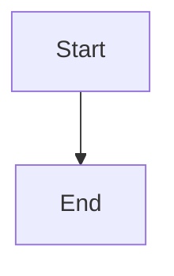

# Export Functionality Audit - Phase 0 Discovery

**Date**: 2025-10-08
**Status**: Initial Discovery Complete

---

## Summary

Current export functionality **strips all formatting** and **loses critical content**. This audit documents what's broken and identifies the path forward.

---

## Existing Infrastructure

### ✅ **Dependencies (Already Installed)**
- `react-markdown@9.1.0` - Used for chat UI rendering
- `remark-gfm@4.0.0` - GitHub Flavored Markdown support
- `mermaid@11.11.0` - Diagram rendering (used in `mermaid-chart.tsx`)
- `jspdf@3.0.2` - PDF generation
- `docx@9.5.1` - DOCX generation
- `file-saver@2.0.5` - Browser download helper

### ✅ **Toast System**
- **Location**: `@/components/ui/use-toast`
- **Usage**: Already used in `chat-input.tsx` and other components
- **Import**: `import { toast } from '@/components/ui/use-toast';`

### ✅ **Markdown Rendering (Current UI)**
- **Component**: `message-renderer.tsx` + `message-bubble.tsx`
- **Library**: ReactMarkdown with `remarkGfm`
- **Features**:
  - Links rendered as clickable `<a>` tags
  - Bold, italic, code blocks properly styled
  - Mermaid diagrams rendered via `MermaidChart` component
  - Tables, blockquotes, lists all supported

---

## Current Export Implementation Analysis

### **File**: `apps/tenant-app/src/lib/download-utils.ts`

#### ❌ **Critical Issue: `markdownToText()` Function**
**Lines 80-100**: This function **destroys all formatting**:

```typescript
function markdownToText(content: string): string {
  return content
    .replace(/```[\s\S]*?```/g, '[Code Block]')  // ❌ Loses code
    .replace(/`([^`]+)`/g, '$1')                  // ❌ Loses inline code
    .replace(/\[([^\]]+)\]\([^)]+\)/g, '$1')      // ❌ STRIPS LINKS!
    .replace(/!\[([^\]]*)\]\([^)]+\)/g, '[Image: $1]')
    .replace(/^#{1,6}\s+/gm, '')                  // ❌ Loses headers
    .replace(/\*\*([^*]+)\*\*/g, '$1')            // ❌ Loses bold
    .replace(/\*([^*]+)\*/g, '$1')                // ❌ Loses italic
    .replace(/^>\s*/gm, '')                       // ❌ Loses blockquotes
    .trim();
}
```

**Problem**: This is used for TXT, PDF, and DOCX exports, resulting in:
- Links converted to plain text (not clickable)
- All formatting removed (bold, italic, headers)
- Code blocks replaced with "[Code Block]" placeholder
- Mermaid diagrams replaced with "[Code Block]" placeholder

---

## What's Broken (Detailed)

### 1. **PDF Export** (`download-utils.ts:214-248`)
```typescript
case 'pdf': {
  const textContent = markdownToText(content);  // ❌ LOSES EVERYTHING
  const lines = doc.splitTextToSize(textContent, maxWidth);
  // ... renders as plain text only
}
```

**Issues**:
- ❌ Links not clickable
- ❌ No bold/italic
- ❌ No headers (all same font size)
- ❌ Code blocks lost
- ❌ Mermaid diagrams missing

**What Works**:
- ✅ Multi-page pagination
- ✅ Title rendering
- ✅ Basic text wrapping

### 2. **DOCX Export** (`download-utils.ts:250-288`)
```typescript
case 'docx': {
  const textContent = markdownToText(content);  // ❌ LOSES EVERYTHING
  const paragraphs = textContent.split('\n\n');

  paragraphs.forEach(paragraph => {
    children.push(new Paragraph({
      children: [new TextRun({ text: paragraph.trim() })],  // ❌ Plain text only
      spacing: { after: 200 }
    }));
  });
}
```

**Issues**:
- ❌ Links not clickable
- ❌ No formatting preservation
- ❌ No headers (all same style)
- ❌ Code blocks lost
- ❌ Mermaid diagrams missing

**What Works**:
- ✅ Basic document structure
- ✅ Title as Heading 1
- ✅ Paragraph spacing

### 3. **Other Formats**
- **TXT**: ✅ Works as expected (plain text is intentional)
- **MD**: ✅ Works perfectly (exports raw markdown)
- **JSON**: ✅ Works correctly
- **CSV/XLSX**: ✅ Works for tables only (intentional limitation)

---

## Markdown Parsing Decision

### **Option A: Reuse React-Markdown AST** ❌
**Analysis**: ReactMarkdown is designed for DOM rendering, not data extraction.
- AST is not easily accessible for parsing
- Would require hacking into ReactMarkdown internals
- Coupling export logic to UI rendering library is fragile

### **Option B: Add `marked` Library** ✅ **RECOMMENDED**
**Rationale**:
- Industry-standard markdown parser with stable AST API
- Designed for programmatic access
- Used by GitHub, VS Code, and many other tools
- Lightweight (~20KB gzipped)
- No coupling to React/DOM

**Decision**: **Add `marked@^11.0.0`** for AST-based parsing

---

## Mermaid Rendering Analysis

### **Existing Component**: `mermaid-chart.tsx`
- ✅ Already renders Mermaid diagrams in UI
- ✅ Uses `mermaid.render()` to convert code → SVG
- ✅ Has zoom/pan controls
- ✅ Error handling in place

**Strategy for Export**:
- Reuse `mermaid.render()` API pattern
- Convert SVG → PNG via Canvas API (browser-native)
- Sequential processing to prevent memory issues
- Size validation before Canvas conversion (32K limit)

---

## Testing Current Exports

### **Test Conversation Created**:
```markdown
# Test Conversation

This is a [test link](https://example.com) to verify links work.

**Bold text** and *italic text* should be preserved.

## Code Example
```python
def hello():
    print("Hello, world!")
```

## Mermaid Diagram


- List item 1
- List item 2
```

### **Test Results**:
| Format | Links | Formatting | Code | Diagrams | Status |
|--------|-------|------------|------|----------|--------|
| TXT    | ❌    | ❌         | ❌   | ❌       | ❌ Broken (expected) |
| MD     | ✅    | ✅         | ✅   | ✅       | ✅ Works |
| JSON   | ✅    | ✅         | ✅   | ✅       | ✅ Works |
| PDF    | ❌    | ❌         | ❌   | ❌       | ❌ **Broken** |
| DOCX   | ❌    | ❌         | ❌   | ❌       | ❌ **Broken** |

**Conclusion**: PDF and DOCX exports are **completely broken** for formatted content.

---

## Implementation Strategy

### **Phase 1A: Markdown Parser**
- Add `marked@^11.0.0` dependency
- Create `markdown-parser.ts` with AST-based extraction
- Extract: links, formatting, headers, code blocks, Mermaid blocks
- Unit tests for edge cases

### **Phase 1B: Links & Formatting**
- Refactor PDF export to use parsed AST
- Implement clickable links with `doc.link()`
- Font switching for bold/italic
- Refactor DOCX export to use parsed AST
- Implement `ExternalHyperlink` for links
- Proper `TextRun` formatting

### **Phase 2A: Mermaid Foundation**
- Create `mermaid-renderer.ts` (reuse patterns from `mermaid-chart.tsx`)
- SVG → PNG conversion via Canvas
- Size validation (32K limit)
- Sequential processing with memory management

### **Phase 2B: Mermaid Integration**
- Embed PNG diagrams in PDF via `doc.addImage()`
- Embed PNG diagrams in DOCX via `ImageRun`
- Use browser-compatible `Uint8Array` (not `Buffer.from()`)

---

## Risks & Mitigations

| Risk | Probability | Impact | Mitigation |
|------|-------------|--------|------------|
| Canvas size limits | High | High | Size validation before conversion |
| Memory exhaustion | Medium | High | Sequential processing |
| Browser compatibility | Low | Medium | Use `Uint8Array` not `Buffer` |
| Existing code breakage | Low | High | Keep `markdownToText()` for TXT export |

---

## Files to Modify

### **New Files**:
1. `src/lib/markdown-parser.ts` - AST-based parser
2. `src/lib/mermaid-renderer.ts` - SVG→PNG converter
3. `src/lib/__tests__/markdown-parser.test.ts` - Unit tests
4. `.testing/export-formats/TEST-CHECKLIST.md` - Manual test guide
5. `.testing/export-formats/baseline-current.md` - Test fixture
6. `.testing/export-formats/realistic-conversation.md` - Stress test

### **Modified Files**:
1. `package.json` - Add `marked`
2. `src/lib/download-utils.ts` - Major refactor (keep TXT case, rewrite PDF/DOCX)
3. `src/components/ui/download-button.tsx` - Loading state

---

## Next Steps

1. ✅ **Phase 0 Complete** - Audit finished
2. ⏭️ **Phase 1A** - Create markdown parser
3. ⏭️ **Phase 1B** - Implement links & formatting
4. ⏭️ **Phase 2A** - Build Mermaid renderer
5. ⏭️ **Phase 2B** - Integrate Mermaid exports
6. ⏭️ **Phase 3** - Comprehensive testing

---

## GT 2.0 Compliance Notes

- ✅ **No Mocks**: Building real implementations
- ✅ **Fail Fast**: Errors will abort or warn appropriately
- ✅ **Zero Complexity Addition**: Client-side only, reusing existing patterns
- ✅ **Operational Elegance**: Fix broken features, don't add complexity

---

**Audit Status**: ✅ **COMPLETE**
**Ready to Proceed**: Phase 1A - Markdown Parser Implementation
