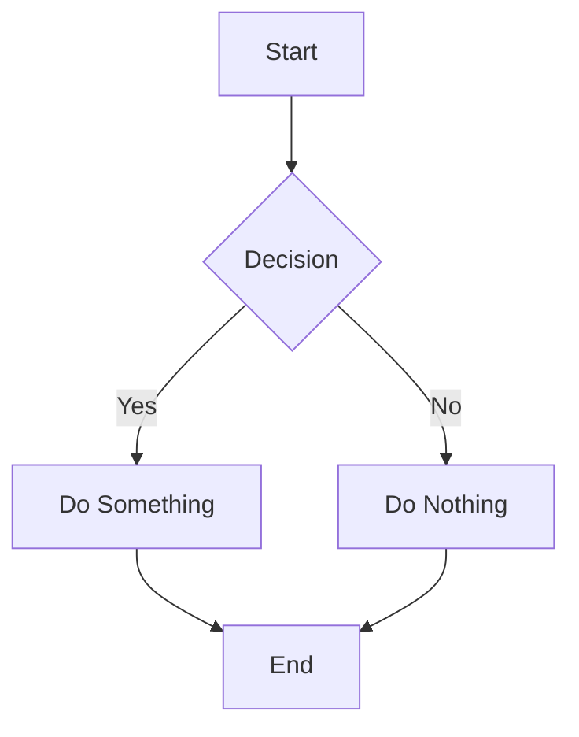
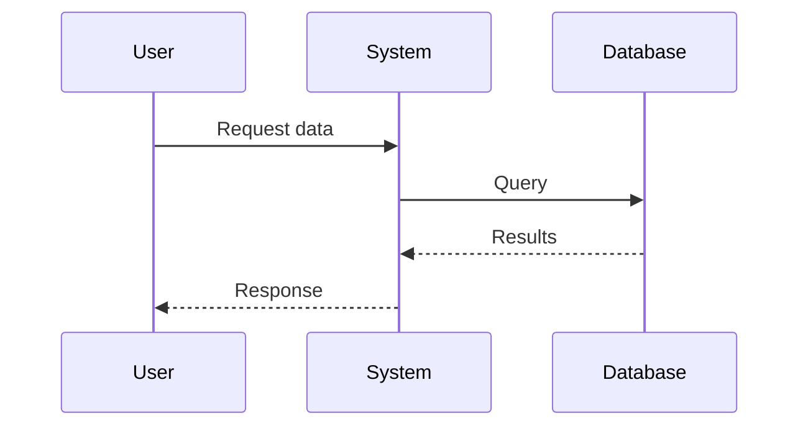

# Test Conversation - Export Baseline

This document tests all markdown features that should be preserved in exports.

## Links Test

This is a [test link to Example.com](https://example.com) that should be clickable.

Here's another link to [Google](https://google.com) for testing.

Relative links like [this one](/docs/guide) should also work.

## Formatting Test

**Bold text** should be bold.

*Italic text* should be italic.

***Bold and italic*** should be both.

`Inline code` should use monospace font.

~~Strikethrough~~ text (if supported).

## Headers Test

# Header 1
## Header 2
### Header 3
#### Header 4
##### Header 5
###### Header 6

## Lists Test

### Unordered List
- Item 1
- Item 2
  - Nested item 2.1
  - Nested item 2.2
- Item 3

### Ordered List
1. First item
2. Second item
3. Third item

## Code Block Test

```python
def hello_world():
    """A simple Python function."""
    print("Hello, world!")
    return True
```

```javascript
function greet(name) {
  console.log(`Hello, ${name}!`);
  return name;
}
```

## Table Test

| Feature | PDF | DOCX | Status |
|---------|-----|------|--------|
| Links | ❌ | ❌ | Broken |
| Bold | ❌ | ❌ | Broken |
| Italic | ❌ | ❌ | Broken |
| Code | ❌ | ❌ | Broken |

## Blockquote Test

> This is a blockquote.
> It should be visually distinct from regular text.

## Mermaid Diagram Test



## Complex Mermaid Test



## Edge Cases

### Empty Lines

This paragraph has empty lines above and below.

### Special Characters

Unicode symbols: ™ © € ⚠️ ✓ ✗

Math symbols: ∑ ∫ √ ∞ ≈ ≠

Arrows: → ← ↑ ↓ ⇒ ⇐

### Emoji Test (May Not Render in PDF)

😀 🚀 ⭐ 💡 ✅ ❌

### Very Long Line Test

This is a very long line of text that should wrap properly in the exported document and not cause any layout issues or overflow problems when rendered in PDF or DOCX format with reasonable margins and page width constraints.

---

## Expected Results After Implementation

✅ All links should be clickable in PDF and DOCX
✅ Bold and italic formatting preserved
✅ Headers should have proper hierarchy
✅ Code blocks should use monospace font
✅ Mermaid diagrams should render as images
✅ Tables should maintain structure
✅ Lists should be properly formatted
