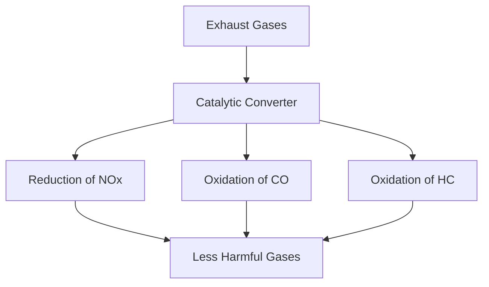

# Test Document: All Formatting Features

This document tests all markdown formatting features in PDF and DOCX exports.

## Headers with Formatting

### This header has **bold text** and *italic text*
#### This header has a [clickable link](https://example.com)

## Bold and Italic Text

This paragraph has **bold text** in the middle of a sentence.

This paragraph has *italic text* in the middle of a sentence.

This paragraph has **bold** and *italic* and [a link](https://example.com) all together.

## Links

Click [here](https://example.com) to visit the site.

Visit [GitHub](https://github.com) or [Google](https://google.com) for more info.

## Bullet Lists

- First item with **bold text**
- Second item with *italic text*
- Third item with [a link](https://example.com)
- Fourth item with **bold**, *italic*, and [link](https://example.com) together

Nested list:
- Parent item
  - Child item with **bold**
  - Child item with *italic*

## Tables

| Component | Description |
|-----------|-------------|
| **Housing** | Stainless‑steel shell that contains the catalyst |
| Monolith | A ceramic structure with **thousands** of channels |
| **Washcoat** | Coated with [platinum](https://example.com) metals |

Second table with links:

| Pollutant | Reaction | Products |
|-----------|----------|----------|
| **NOₓ** (reduction) | NOₓ → N₂ + O₂ | Nitrogen (**N₂**) + Oxygen |
| **CO** (oxidation) | 2 CO + O₂ → 2 CO₂ | Carbon dioxide |
| HC | See [docs](https://example.com) | CO₂ + H₂O |

## Complex Formatting

### Environmental Impact

- **Environmental impact**: Up to **98%** of pollutants removed, see [EPA report](https://epa.gov)
- **Regulatory compliance**: U.S. standards ([EPA](https://epa.gov), [CARB](https://arb.ca.gov)) require catalysts
- **Vehicle performance**: Properly functioning converters help maintain *optimal air‑fuel ratios*

## Mermaid Diagram

## End of Test

All formatting features tested above.
